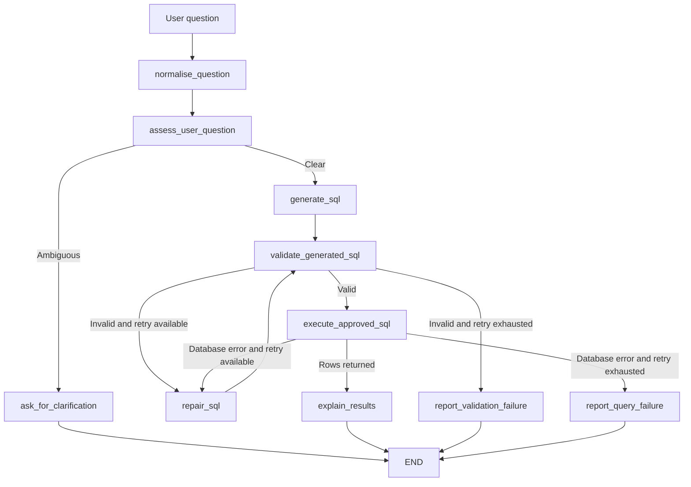

# Football Database Analyst — Project Overview

## What this project is

This project is a **safe natural-language analyst for a PostgreSQL football database**.

A user asks a question in ordinary language, such as:

```text
Who are the five top scorers of all time?
```

The application uses LangGraph to coordinate a workflow that:

1. checks whether the question needs clarification;
2. asks an LLM to propose SQL;
3. validates that SQL before it can run;
4. executes only approved read-only SQL against PostgreSQL;
5. lets an LLM explain the real rows returned by the database; and
6. makes at most one controlled repair attempt if SQL fails.

It is not a chatbot that guesses football facts from model training data. PostgreSQL is the source of truth for every factual answer.

## The main idea

```text
Natural-language question
  -> LangGraph workflow
  -> safe SQL proposal
  -> PostgreSQL facts
  -> readable answer
```

The project deliberately separates the responsibilities:

| Component | Responsibility |
| --- | --- |
| First LLM | Interpret the question and propose SQL. |
| SQL validator | Decide whether the proposal is safe enough to continue. |
| PostgreSQL | Return factual data. |
| Second LLM | Explain only the returned facts in normal language. |
| LangGraph | Keep shared state and route between all stages. |

## Architecture



## What LangGraph does here

LangGraph is not the LLM itself. It is the workflow framework that defines:

- the shared state;
- the nodes that do work;
- the edges between nodes; and
- the conditional routes based on the current state.

### Shared state

`AnalystState` is a typed description of the shared case file for one question.

Important fields include:

```text
question                 Original user question
normalised_question      Cleaned question
needs_clarification      Whether user input is needed before SQL generation
clarification_question   Follow-up question, if needed
interpretation           What the LLM believes the question means
proposed_sql             Current SQL proposal
sql_is_valid             SQL validator decision
validation_errors        Safety-check errors
approved_sql             SQL allowed to reach PostgreSQL
query_rows               Real rows returned by PostgreSQL
query_error              PostgreSQL execution error, if one occurs
repair_count             Number of repair attempts used
answer                   Final user-facing response
```

### Nodes

A node is an ordinary Python function that receives state and returns updates to state.

For example, `execute_approved_sql` reads `approved_sql`, sends it to the protected database function, and returns either `query_rows` or `query_error`.

### Edges and conditional edges

Edges define the workflow order. Conditional edges let the graph choose the next node at runtime.

For example:

```text
SQL valid?       -> execute it
SQL invalid?     -> repair it once
Repair exhausted -> report the failure
```

This is why LangGraph fits the project better than a simple one-prompt, one-response chain.

## LLM use in the project

The project uses `gpt-5.6-terra` through `langchain-openai`.

There are three focused LLM responsibilities:

### 1. Clarification assessment

`question_router.py` decides whether a question is sufficiently specific.

Example:

```text
Which team is the best?
```

The correct response is a clarification request because “best” could mean points, goal difference, recent form, or another metric, and the database includes multiple seasons.

### 2. SQL proposal and repair

`sql_generator.py` creates the first SQL proposal. If validation or PostgreSQL reports a problem, the same module can make one corrected proposal using:

- the original question;
- the intended interpretation;
- the failed SQL; and
- the precise error message.

### 3. Result explanation

`result_explainer.py` receives only the executed query’s returned rows. It has no database connection and does not generate additional SQL.

Its job is language, not fact-finding.

## Structured output

The LLM calls use Pydantic models and structured output. Instead of hoping the model returns text in the right shape, Python expects predictable objects.

Examples:

```python
class SqlProposal(BaseModel):
    interpretation: str
    sql: str
```

```python
class QuestionAssessment(BaseModel):
    needs_clarification: bool
    clarification_question: str | None
```

```python
class ResultExplanation(BaseModel):
    answer: str
```

Structured output makes it safer and easier for LangGraph nodes to read model results.

## Database safety

This is a central part of the project.

An LLM is allowed to suggest SQL, but it is never trusted to execute SQL directly.

### Layer 1 — SQL parser and validator

`sql_validator.py` uses SQLGlot to check the SQL structure.

It rejects:

- empty SQL;
- syntax errors;
- more than one statement;
- non-`SELECT` statements such as `DELETE`, `INSERT`, `UPDATE`, or `DROP`;
- `SELECT INTO`; and
- table names outside the allow-list.

### Layer 2 — Python execution boundary

`database.py` exposes `execute_approved_query()`.

It validates SQL again before running it and limits the result to 100 rows.

This is defence in depth: a future coding mistake cannot easily bypass validation just by calling the database helper directly.

### Layer 3 — PostgreSQL permissions

The app connects as `football_analyst`, a login role that inherits permissions from the `football_readonly` role.

The account has read access but not write access.

### Layer 4 — Read-only connection and timeout

The PostgreSQL connection is created with:

```text
default_transaction_read_only=on
statement_timeout=5000
```

So every app connection is read-only and long-running statements time out after five seconds.

### Layer 5 — Bounded repair

The workflow has:

```python
MAX_REPAIR_ATTEMPTS = 1
```

It can make one correction attempt, but cannot loop indefinitely or repeatedly spend API credits.

Every repaired query goes back through SQL validation before it can reach PostgreSQL.

## User interface

The current application is a Python command-line interface.

### Direct question

```bash
python analyst/main.py "Who are the five top scorers of all time?"
```

### Interactive first question

```bash
python analyst/main.py
```

### Developer debug mode

```bash
python analyst/main.py --debug "Which team is the best?"
```

Normal mode uses `graph.invoke()` and prints the final answer only.

Debug mode uses `graph.stream()` and prints the complete state after every node. This is useful when developing or demonstrating the LangGraph workflow.

### Clarification loop

If the graph asks a clarification question, the CLI lets the user type an answer. It combines the original question and the clarification, then invokes the graph again.

This is intentionally simple. A future web version can use persistent session state or LangGraph checkpointing for a fuller conversation experience.

## Tests

The project has automated tests using pytest.

Run them with:

```bash
python -m pytest -q
```

The current result is:

```text
12 passed
```

### SQL validator tests

These confirm that safe `SELECT` queries pass and that dangerous or malformed SQL is rejected.

### Graph routing tests

These confirm that:

- ambiguous questions route to clarification;
- clear questions route to SQL generation;
- an invalid query gets one repair attempt;
- a second failed attempt reports a failure rather than looping forever; and
- successful execution routes to result explanation.

The tests do not call OpenAI, Docker, or PostgreSQL. They are fast and free to run.

## Project files

```text
analyst/
├── main.py
│   LangGraph graph, node functions, routing, and CLI
├── question_router.py
│   LLM-based ambiguity assessment
├── sql_generator.py
│   Structured SQL proposal and controlled repair
├── sql_validator.py
│   SQLGlot parser, allow-list, and safety rules
├── database.py
│   Protected read-only PostgreSQL connection and query execution
├── result_explainer.py
│   LLM explanation based only on returned database rows
├── requirements.txt
├── .env.example
├── README.md
└── STEP_*.md
├── conftest.py
├── test_sql_validator.py
└── test_graph_routing.py
```

## How to run from a fresh clone

```bash
python3 -m venv analyst/.venv
source analyst/.venv/bin/activate
python -m pip install -r analyst/requirements.txt
cp analyst/.env.example analyst/.env
```

Then add real values to the private `analyst/.env` file, start the football PostgreSQL database, and run:

```bash
python analyst/main.py "Who are the five top scorers of all time?"
```

Never commit the real `.env` file.

## What the project demonstrates

This project is strong portfolio evidence for:

- Python application development;
- PostgreSQL and SQL;
- LangGraph orchestration and stateful workflows;
- LLM structured output;
- safe text-to-SQL design;
- conditional routing and bounded retries;
- error handling;
- testing with pytest;
- environment-variable secret handling; and
- clear project documentation.

## Current limitations

- The database schema summary given to the LLM is hand-written and must be maintained as the database evolves.
- The LLM can still misunderstand a business question; SQL safety does not guarantee semantic perfection.
- Clarification is handled by a simple fresh graph rerun, not persistent memory.
- The current interface is a CLI rather than a webpage.

## Next direction

The natural next step is a simple Streamlit webpage that calls this same graph. It can be deployed with the database on a server using Docker Compose, while keeping PostgreSQL private and exposing only the web application.
