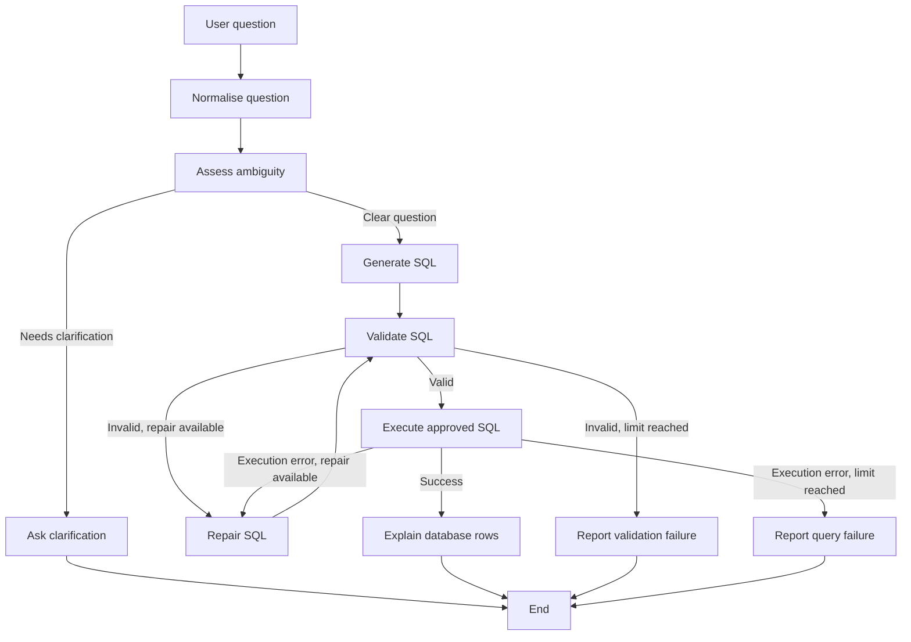

# Football Database Analyst

A safe natural-language interface for a PostgreSQL football database, built with LangGraph, OpenAI, and Python.

Users can ask questions such as:

> Who are the five top scorers of all time?

The application turns the question into SQL, validates it, runs only approved read-only queries, and explains real database results in natural language.

## Features

- Natural-language football questions
- LangGraph workflow with conditional routing
- LLM-based SQL generation with structured output
- Clarification for ambiguous questions
- SQL parsing and table allow-list validation
- Read-only PostgreSQL role and transaction
- One controlled SQL repair attempt
- Grounded explanations based only on returned database rows
- Command-line interface with normal and debug modes
- Automated tests for SQL safety and graph routing

## Architecture



## Safety design

The LLM never receives direct database access.

```text
LLM → proposes SQL
Validator → accepts or rejects SQL
PostgreSQL → returns factual rows
LLM → explains only returned rows
```

Safety controls include:

- exactly one SQL statement;
- `SELECT` or `WITH ... SELECT` queries only;
- allow-listed tables only;
- parser-based validation with SQLGlot;
- a PostgreSQL account with read-only permissions;
- read-only transactions;
- a five-second statement timeout;
- a maximum of 100 returned rows;
- one repair attempt maximum.

## Prerequisites

- Python 3.14 or compatible Python 3 version
- Docker and Docker Compose
- An OpenAI API key
- The football PostgreSQL database running locally

## Setup

From the repository root:

```bash
python3 -m venv analyst/.venv
source analyst/.venv/bin/activate
python -m pip install -r analyst/requirements.txt
```

Create your private environment file:

```bash
cp analyst/.env.example analyst/.env
```

Add your real PostgreSQL password and OpenAI API key to `analyst/.env`.

Start the database:

```bash
docker compose up -d
```

## Run the analyst

Ask a question directly:

```bash
python analyst/main.py "Who are the five top scorers of all time?"
```

Or start in interactive mode:

```bash
python analyst/main.py
```

Use debug mode to inspect LangGraph state after each node:

```bash
python analyst/main.py --debug "Which team is the best?"
```

## Run tests

```bash
python -m pytest -q
```

The tests verify SQL validation rules and graph routing behaviour without calling OpenAI or PostgreSQL.

## Example questions

```text
Who are the five top scorers of all time?
Which team is the best?
Who scored the most non-own goals?
```

Questions with important ambiguity, such as “Which team is the best?”, trigger a clarification request before SQL generation.

## Project structure

```text
analyst/
├── main.py
├── question_router.py
├── sql_generator.py
├── sql_validator.py
├── database.py
├── result_explainer.py
├── requirements.txt
├── .env.example
├── README.md
├── conftest.py
├── test_sql_validator.py
└── test_graph_routing.py
```

## Future improvements

- Streamlit web interface
- Persistent multi-turn conversations
- More test cases and evaluation datasets
- Docker deployment for the analyst application
- Authentication and HTTPS for public deployment